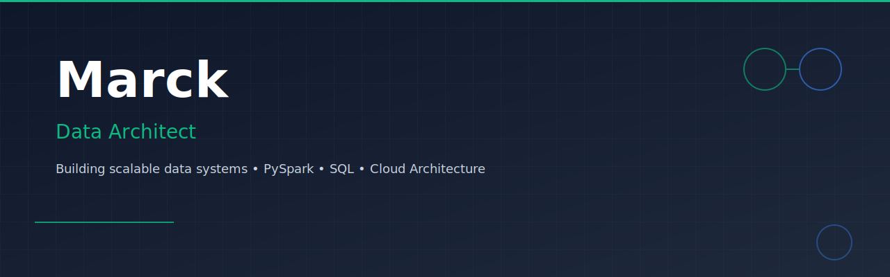

<div align="center">

# Giomar Guerra

### Junior Data Architect • Data Engineering • Big Data

[](https://www.linkedin.com/in/data-giomar/)
[](mailto:giomarguerra0@gmail.com)
[](https://github.com/GiomarGuerra)

</div>

---
<div align="center">

# ✨ About Me

</div>

```python
class GiomarGuerra:

    location = "Lima, Peru 🇵🇪"
    role = "Junior Data Architect"

    interests = [
        "Data Architecture",
        "Data Engineering",
        "Big Data",
        "Analytics"
    ]

    currently_learning = [
        "Azure",
        "AWS",
        "Apache Spark",
        "Apache Airflow"
    ]

    tech_stack = {
        "Languages": ["Python", "SQL"],
        "Processing": ["PySpark", "Pandas"],
        "Databases": ["PostgreSQL"],
        "Visualization": ["Power BI"],
        "Tools": ["Git", "Docker", "Jupyter"]
    }

    philosophy = (
        "Design reliable data solutions that transform raw data into decisions."
    )
```
---
<div align="center">

# 💬 Tech Stack

</div>


<div align="center">

# ⚡Skills

</div>


```text
Data Architecture  ████████████████░░░░
Python             ███████████████░░░░░
SQL                ███████████████░░░░░
PySpark            █████████████░░░░░░░
Power BI           ████████████░░░░░░░░
Cloud              ████████░░░░░░░░░░░░
```

---


<div align="center">

# 👨‍💻 Featured Projects

</div>

<table>

<tr>

<td width="50%" valign="top">

### 🚀 Big Data Pipeline

End-to-end academic project focused on designing a scalable data architecture.

```text
✔ ETL Pipeline
✔ Star Schema
✔ PySpark
✔ PostgreSQL
✔ Power BI
```

[](https://github.com/GiomarGuerra/TU-REPO)

</td>

<td width="50%" valign="top">

### 🤖 StudyBrain

Architecture proposal for an AI educational platform.

```text
✔ AI Router
✔ Observability
✔ Next.js
✔ Prisma
✔ Ollama
```

[](https://github.com/GiomarGuerra/TU-REPO)

</td>

</tr>

</table>

---
<div align="center">

# 🌱 Currently Learning

</div>


- Azure
- AWS
- Apache Airflow
- Microsoft Fabric
- Data Governance

---
<div align="center">

# 🔭 Goals

</div>


- Build production-ready data projects.
- Strengthen cloud data architecture skills.
- Earn Azure data certifications.
- Start my career as a Junior Data Architect.

---
<div align="center">

# 💼 Contact

[](https://www.linkedin.com/in/data-giomar/)
[](mailto:giomarguerra0@gmail.com)
[](https://github.com/GiomarGuerra)

</div>


<div align="center">

> Building scalable data solutions, one project at a time.

⭐ Thanks for visiting my profile.

<!--
**GiomarGuerra/GiomarGuerra** is a ✨ _special_ ✨ repository because its `README.md` (this file) appears on your GitHub profile.

Here are some ideas to get you started:

- 🔭 I’m currently working on ...
- 🌱 I’m currently learning ...
- 👯 I’m looking to collaborate on ...
- 🤔 I’m looking for help with ...
- 💬 Ask me about ...
- 📫 How to reach me: ...
- 😄 Pronouns: ...
- ⚡ Fun fact: ...
-->
